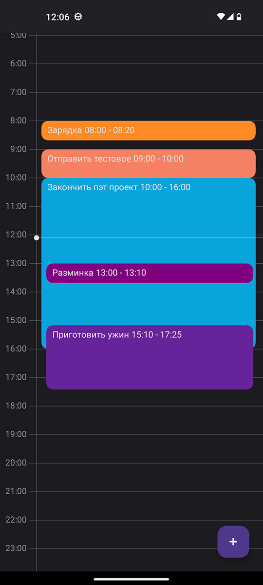
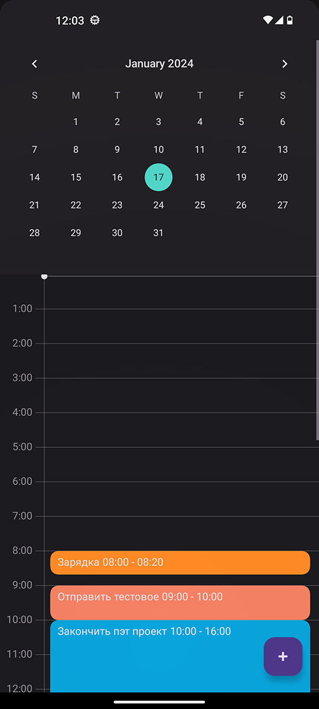
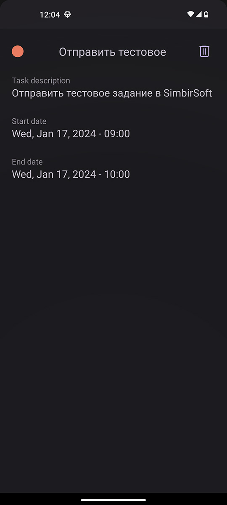
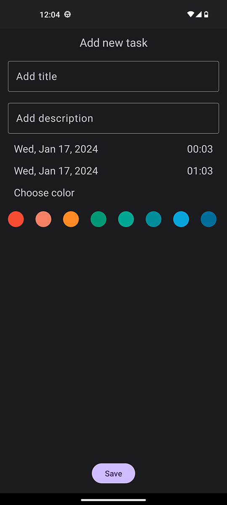

# Тестовое задание для SimbirSoft Android
# Скриншоты приложения
| 1 Экран | 1 Экран | 3 Экран | 2 Экран |
| ------------- | ------------- | ------------- | ------------- |
|   |  |   |  |
# Описание
### Описание приложения
> В приложении присутствуют 3 экрана: Список дел по датам, детали задачи, добавление новой задачи
> #### Список дел по датам:
>> + Календарь выбора даты
>> + Таблица дел
> #### Детали задачи:
>> + Подробная информация о задаче
>> + Кнопка "Удалить задачу"
> #### Добавление новой задачи:
>> + Поле для ввода названия задачи
>> + Поле для ввода описания задачи
>> + Выбор даты начала
>> + Выбор времени начала
>> + Выбор даты окончания
>> + Выбор времени окончания
>> + Список доступных цветов
>> + Кнопка "Сохранить задачу"
# Примечания
> + С нуля реализовано Custom View для отображения списка задач.
> + Каждая задача располагается в таблице согласно времени её начала и окончания с точностью до минуты.
> + Для удобства использования, был добавлен индикатор в виде горизонтальной полосы, располагающийся на таблице согласно текущего времени.
> + Если задачи пересекаются по времени - более поздняя задача отображается с меньшими размерами
# О проекте
> + Архитектура - MVVM + CleanArchitecture
> + Другие паттерны: Singlton
> + Технологии: Room, Dagger2, Navigation component, Kotlin Coroutines, ViewBinding
> + Написан простой unit-тест с использованием JUnit и MockK
